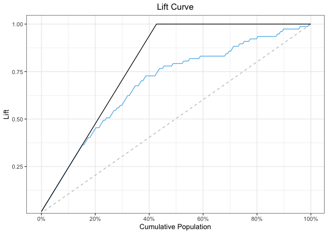

<!-- README.md is generated from README.Rmd. Please edit that file -->
R package helda (HELpful functions for Data Analysis in R)
==========================================================

<!-- badges: start -->
[](https://CRAN.R-project.org/package=helda)
[](https://travis-ci.com/Redcart/helda)
[](https://codecov.io/gh/Redcart/helda?branch=master)
[](https://www.rdocumentation.org/packages/helda)
[](https://www.gnu.org/licenses/gpl-3.0)
[](https://cranlogs.r-pkg.org/badges/grand-total/helda)
<!-- badges: end -->

Overview
--------

This package provides functionalities that aim at facilitating and
saving time when analysing data.

Installation
------------

You can install helda from CRAN by simply running:

``` r
install.packages("helda")
```

Development version
-------------------

To get a bug fix, or use a feature from the development version, you can
install helda from this GitHub repository.

``` r
# install.packages("devtools")
devtools::install_github("Redcart/helda")
```

Usage
-----

This is a quick introduction to the lift curve function of the package:

``` r
library(helda)

data_training <- titanic_training
data_validation <- titanic_validation

model_glm <- glm(formula = "Survived ~ Pclass + Sex + Age + 
                 SibSp + Fare + Embarked",
                 data = data_training,
                 family = binomial(link = "logit"))

predictions <- predict(object = model_glm, 
                       newdata = titanic_validation, 
                       type = "response")

plot <- lift_curve(predictions = predictions, 
                   true_labels = titanic_validation$Survived, 
                   positive_label = 1)

plot
```



Getting help
------------

If you encounter a clear bug, please file a minimal reproducible example
on the [issues section](https://github.com/Redcart/helda/issues) of the
repository.

Author
------

Simon Corde
